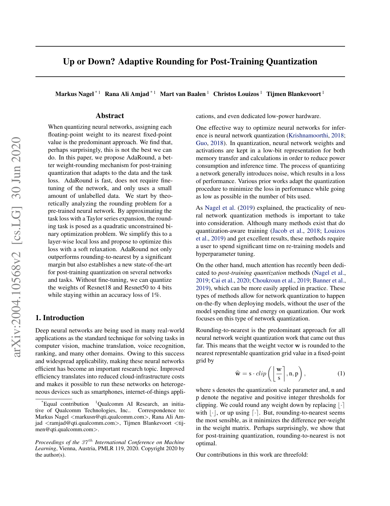

# Up or Down? Adaptive Rounding for Post-Training Quantization (ICML 2020)

**Problem**: Nearest rounding $\mathrm{round}(x/\Delta)$ is not task-optimal.

**AdaRound formulation**
- For weight $w$, learn a rounding offset $\alpha$:
  $$\tilde w = \Delta \cdot \mathrm{round}\!\left(\tfrac{w}{\Delta} + \alpha\right) - \Delta \alpha,$$
  where $\alpha \in [0,1]$ (per-weight or per-block).
- Relax rounding with a sigmoid during optimization:
  $$\mathrm{round}_\tau(z) = z - \sigma_\tau\big(z-\lfloor z \rfloor - 0.5\big) + 0.5,$$
  with temperature $\tau \downarrow 0$ (smooth $\rightarrow$ hard rounding).

**Optimization**
- Minimize calibration loss:
  $$\min_{\alpha} \; \mathcal{L}_{\text{calib}}\!\left(Q_\alpha(W); \text{data}\right) + \lambda \sum \mathrm{reg}(\alpha),$$
  where $Q_\alpha$ uses learned rounding; regularizer pulls $\alpha$ toward integers (0 or 1).
- After convergence, snap to hard rounding with learned offsets.

**Findings (paper)**
- Improves PTQ accuracy on CNNs/transformers vs nearest rounding; no full finetuning required.

**Use here**
- PTQ baseline; same offset idea could tune SeedLM coefficients when quantized.

