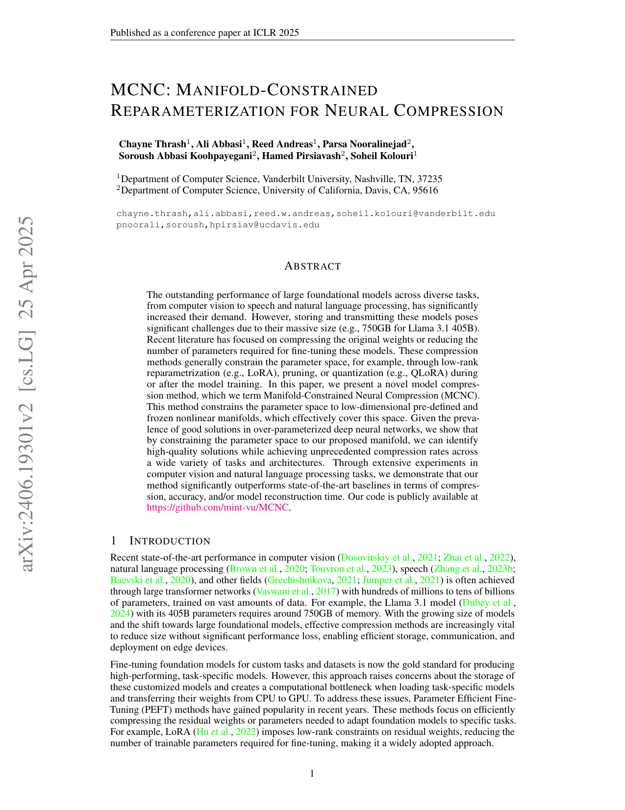

# MCNC: Manifold-Constrained Reparameterization for Neural Compression (ICLR 2025)

**Problem**: Compress massive transformers while keeping optimization stable by enforcing geometric structure on compressed parameters.

**Parameterization**
- Each weight block $W \\in \\mathbb{R}^{m\\times n}$ is mapped from a latent $Z$ that lies on a manifold (e.g., Stiefel manifold of orthonormal columns, Grassmann).
- Decoder $f_\\theta$ reconstructs weights: $\\hat W = f_\\theta(Z)$ with constraints $Z \\in \\mathcal{M}$.

**Objective**
- Reconstruction/compression loss:
  $$\\min_{Z \\in \\mathcal{M},\\,\\theta} \\; \\|W - f_\\theta(Z)\\|_F^2 + \\lambda\\,\\mathcal{R}(Z,\\theta),$$
  where $\\mathcal{R}$ may encourage low-rank or sparsity in the decoded weights.
- During finetuning, task loss $\\mathcal{L}_{task}(f_\\theta(Z))$ replaces reconstruction.

**Manifold optimization**
- Use Riemannian gradient steps on $Z$ with retraction $\\mathrm{Retr}_Z$:
  $$Z \\leftarrow \\mathrm{Retr}_Z(-\\eta \\, \\mathrm{grad}_Z \\mathcal{L}).$$
- Projection keeps $Z$ on $\\mathcal{M}$ (PGD-compatible), improving stability over unconstrained updates.

**Key effects**
- Implicit regularization: orthogonality/normalization in $Z$ controls Lipschitzness of $\\hat W$.
- Compression: storage is latent $Z$ (low-dim) + decoder parameters (shared).

**Findings (paper)**
- Storage reduction on large Llama variants with minimal accuracy loss.
- More stable finetuning than unconstrained low-rank baselines.

**Use here**
- PGD projection operator baseline for SeedLM manifold comparisons; could reuse retraction ops for seed-coefficient manifolds.

