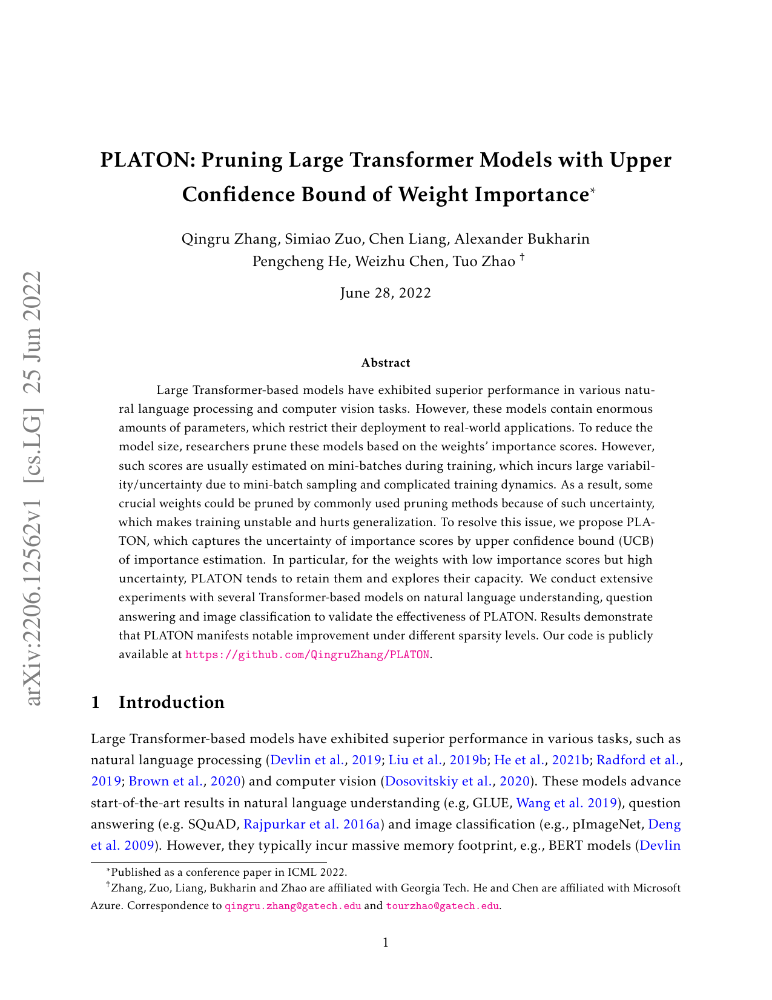

# PLATON: Pruning Large Transformer Models with UCB of Weight Importance (ICML 2022)

**Problem**: Importance estimates from minibatches are noisy; naive magnitude pruning may drop crucial weights.

**Bandit/UCB framing**
- For each weight (or block) $w_j$, maintain estimate $\\hat \\mu_j$ (importance) and uncertainty $\\hat \\sigma_j$ from minibatch statistics.
- Upper Confidence Bound score:
  $$\\mathrm{UCB}_j = \\hat \\mu_j + \\beta \\hat \\sigma_j,$$
  with exploration parameter $\\beta$.
- Prune weights with lowest UCB, balancing exploitation (high mean) and exploration (uncertainty).

**Importance estimation**
- Often derived from gradients/activations: e.g., $\\hat \\mu_j \\propto \\mathbb{E}[|w_j \\cdot a_j|]$ or Fisher/Hessian diagonals; $\\hat \\sigma_j$ from batch variance.

**Procedure**
1) Collect stats over calibration batches.
2) Compute $\\mathrm{UCB}_j$.
3) Prune lowest-scoring weights to target sparsity (iterative or one-shot).
4) Optional light finetuning.

**Findings (paper)**
- Outperforms magnitude pruning at equal sparsity on transformers; robustness from uncertainty term.

**Use here**
- Pruning baseline vs SparseGPT/Wanda; can precede seed-based encoding on the remaining weights.

