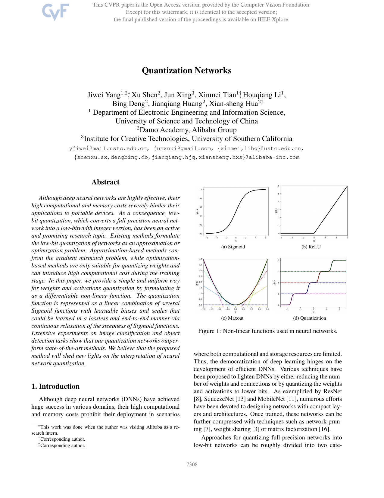

# Quantization Networks (CVPR 2019)

**Problem**: Fixed, hand-crafted quantizers and uniform bitwidths can underfit at low precision.

**Learned quantizer parameterization**
- Quantizer $Q_\\phi(x)$ with learnable scale/offset/bitwidth; forward uses
  $$\\tilde x = \\mathrm{clip}\\Big(\\mathrm{round}\\big(\\tfrac{x}{\\Delta}\\big), q_{min}, q_{max}\\Big), \\quad Q_\\phi(x) = \\Delta \\tilde x,$$
  where $\\Delta$ (and sometimes $q_{min},q_{max}$ or bitwidth) are learnable via a small network.

**Soft-to-hard annealing**
- Replace $\\mathrm{round}(\\cdot)$ with a smooth approximation $\\mathrm{round}_\\tau$ during training, temperature $\\tau \\downarrow 0$ so gradients flow early, converge to hard quantization late.
- Straight-through estimators (STE) used for backprop through $\\mathrm{round}$ in later stages.

**Mixed precision**
- Bitwidth selection can be parameterized with Gumbel-Softmax over candidate bits; loss includes complexity regularizer:
  $$\\mathcal{L} = \\mathcal{L}_{task} + \\lambda \\sum_\\ell c(b_\\ell),$$
  where $b_\\ell$ is sampled/relaxed bitwidth for layer $\\ell$ and $c(\\cdot)$ penalizes high bits.

**Findings (paper)**
- On ResNet/MobileNet, learned quantizers match or beat hand-designed PTQ at 2–4 bits.
- Learns non-uniform step sizes where beneficial; mixed precision emerges automatically.

**Use here**
- Vision baseline; ideas transferable to ViT/DeiT and to learned coefficient quantization for SeedLM.

