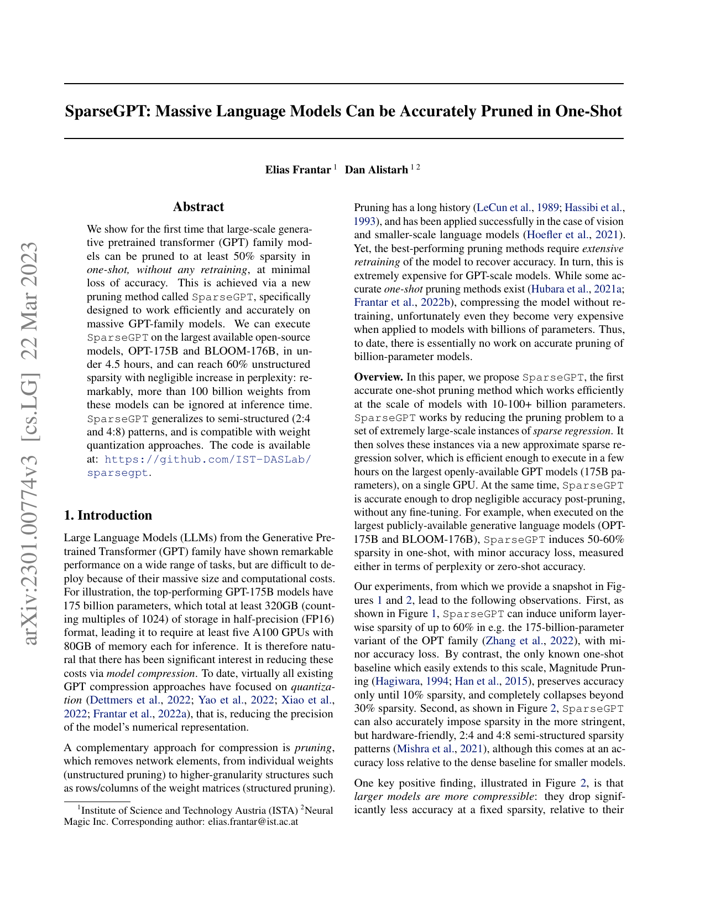

# SparseGPT: Massive Language Models Can Be Accurately Pruned in One-Shot (ICML 2023)

**Problem**: Prune 100B-scale GPT models in one shot, no retraining, minimal perplexity loss.

**Hessian-aware pruning (per block)**
- Approximate loss with quadratic form using Hessian $H$ and gradient $g$:
  $$\\mathcal{L}(W + \\Delta W) \\approx \\mathcal{L}(W) + g^\\top \\Delta W + \\tfrac{1}{2} \\Delta W^\\top H \\Delta W.$$
- Goal: choose sparse mask $M$ to minimize quadratic reconstruction:
  $$\\min_{M} \\; \\| H^{1/2} (W - M \\odot W) \\|_F^2,$$
  where $M \\odot W$ keeps selected weights. Often solved greedily per column/row with local LS updates given $H$.

**Procedure**
1) Estimate blockwise Hessian (diagonal/low-rank) from a small calibration set.
2) For each block: select weights to keep by minimizing quadratic error; drop the rest (one-shot).
3) Assemble sparse model; optional tiny finetune (usually skipped).

**Findings (paper)**
- Achieves ~50–60% unstructured sparsity on OPT/BLOOM with negligible perplexity increase.
- Runs efficiently on 100B+ models (few hours).

**Use here**
- Strong pruning baseline; candidate precursor to seed-encoding the retained weights (sparse+seed hybrid).

